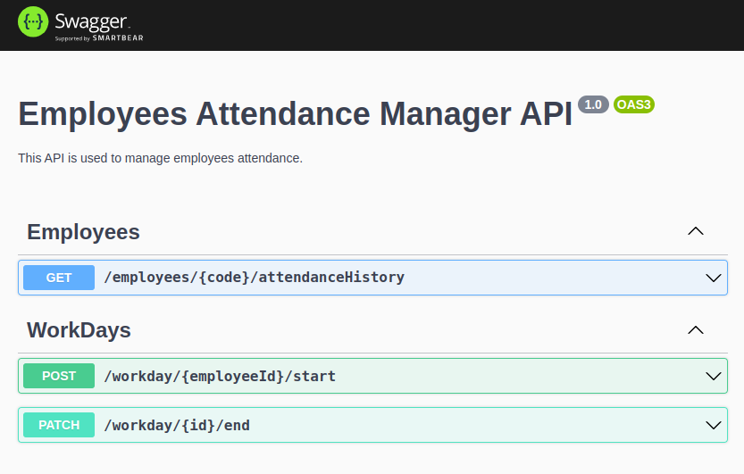

# Attendance Manager API


## Descrição

Api desenvolvida como parte do processo seletivo para a empresa Ilumeo.

O objetivo era desenvolver uma API onde fosse possível o funcionário marcar o seu horário de entrada e saída, assim como vizualizar o histórico de horas trabalhadas.


## Tecnologias
O banco de dados utilizado foi o ProstgreSQL, dentro de um container Docker.

Para criação das migrations, acesso e manipulação do banco de dados, utilizei o ORM [Prisma](https://www.prisma.io/).

A Aplicação foi criada em Node.JS com Typescript, utilizando o framework [Nest.JS](https://nestjs.com/).

## Deploy

Para documentar a API, visualizar a estrutura e ainda poder testá-la pelo navegador, foi incluído o [Swagger](https://swagger.io/).

Foi feito o deploy da aplicação no [Render](https://render.com/), que pode ser acessado [neste link](https://ilumeo-attendance-manager.onrender.com/api).

:exclamation: Por se tratar de um deploy gratuito, após 15 minutos de inatividade, a aplicação ficará inativa, e a primeira requisição após esse período irá demorar mais que o normal, pois só será respondida após reinicialização da aplicação.

<hr>


## Instalação

:exclamation: Será necessário subir um container com o banco de dados da aplicação, então caso ainda não possua o [Docker](https://docs.docker.com/) instalado, faça primeiro a instalação para seguir com os próximos passos.

### 1 - Inclua as variáveis de ambiente

Renomeie o arquivo `variables.env` para `.env`, para que as variáveis de ambiente serjam reconhecidas.

### 2 - Suba o container do banco de dados

```bash
$ sudo docker-compose up
```

### 3 - Rode as migrations
```bash
$ npx prisma migrate dev
```

### 4 - Alimente o banco de dados com alguns dados iniciais

```bash
$ npx prisma db seed
```

### 5 - Instale as dependências
```bash
$ npm install
```
<hr>


## Rodando a aplicação


```bash
# development
$ npm run start

# watch mode
$ npm run start:dev
```
<hr>

## Swagger

Após subir a aplicação, poderá visualizar as rotas e testá-las através do swagger, em [http://localhost:3000/api](http://localhost:3000/api)

<hr>

## Rotas

### GET /employees/{code}/attendanceHistory

Recebe o código de funcionário {`code`} na rota e retorna o histórico de ponto e id do funcionário, no seguinte formato:

```json
{
  "workDays": [
    {
      "id": "8a3c2ff2-2978-4d79-88ea-6398ce1cfe03",
      "employee_id": "d0d45305-50bb-4c74-830b-2f86f2a2cbba",
      "work_day_start": "2023-02-26T12:00:00.000Z",
      "work_day_end": "2023-02-26T20:00:00.000Z"
    },
    {
      "id": "8d95a83a-4961-47f4-81b8-6d26febe71b9",
      "employee_id": "d0d45305-50bb-4c74-830b-2f86f2a2cbba",
      "work_day_start": "2023-02-27T12:00:00.000Z",
      "work_day_end": "2023-02-27T20:00:00.000Z"
    }
  ],
  "id": "d0d45305-50bb-4c74-830b-2f86f2a2cbba"
}

```

### POST /workday/{employeeId}/start

Recebe o id do funcionário {`employeeId`} pela rota e retorna o dia de trabalho que foi registrado no banco, no seguinte formato:

```json
{
  "id": "fde7da82-75ff-45a3-a477-f5b654428266",
  "employee_id": "d0d45305-50bb-4c74-830b-2f86f2a2cbba",
  "work_day_start": "2023-03-06T04:09:30.858Z",
  "work_day_end": null
}

```
### PATCH /workday/{id}/end 

Recebe o id do dia de trabalho {`id`} que foi criado na rota `/start`, inclui o horário final do dia de trabalho e retorna o registro atualizado do banco, no seguinte formato:

```json
{
  "id": "fde7da82-75ff-45a3-a477-f5b654428266",
  "employee_id": "d0d45305-50bb-4c74-830b-2f86f2a2cbba",
  "work_day_start": "2023-03-06T04:09:30.858Z",
  "work_day_end": "2023-03-06T04:11:10.978Z"
}
```